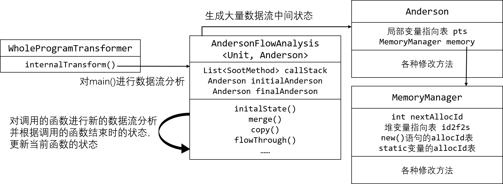

# 软件分析技术-指针分析作业报告

何昊 2001111320    董谨豪 2001111316

## 算法思想

我们使用数据流分析的框架来实现指针分析算法，在每个节点记录完整的局部变量指向状态和内存状态。

在数据流分析中，定义地址集合为$A$，我们定义每个节点的状态为
$$
状态=\{局部变量指向表,堆变量指向表\}\\
局部变量指向表=\{(v_i,P_i)|v_i \in 当前方法的变量, P_i \subseteq A\}\\
堆变量指向表=\{(a_i, 域, P_i)|a_i \in A, P_i \subseteq A, \}
$$
在堆变量指向表中，定义$(a_i,\emptyset,P_i)$为$a_i$自己可能指向的内存位置。

对于方法$m$，数据流分析的流程如下

```
def 数据流分析(m):
  初始状态 = {包含调用参数的局部变量指向表, 调用m的函数的堆变量指向表}
  最终状态 = {}
  def 合并(状态A, 状态B): 
    将局部变量指向表按照v_i合并
    将堆变量指向表按照a_i和域合并
  def 给定语句u和之前的状态，生成新的状态:
    if u是方法调用:
      if 是benchmarkN.test: 将当前分析结果保存
      elif 是benchmarkN.alloc: 获取当前allocId
      elif 不是系统函数: 
        状态X = 数据流分析(u调用的方法)
        局部变量指向表.返回值变量 = 状态X.局部变量指向表.ret
        堆变量指向表与状态X的堆变量指向表合并
    elif u是返回语句:
      状态A.局部变量指向表.ret = 返回值可能指向的位置
      最终状态与当前状态合并
    elif u是new语句:
      获取这个new语句的allocId
      if u形如a = new A():
        局部变量指向表.a = { allocId }
      elif u形如A.f = new A():
        将allocId加入堆变量指向表.(A.f)
    elif u是各种赋值语句:
      if u形如a = b:
        用b指向的位置替换a指向的位置
      elif u形如a.f = b:
        如果a指向一个内存位置，则用b指向的位置替换a.f指向的位置
        如果a指向多个内存位置，则将b指向的位置加入所有a.f指向的位置
      elif u形如a = b.f:
        用b.f指向的全部可能位置替换a指向的位置
```

如果我们认为同一个语句位置的new所返回的结果始终为同一个内存位置，由于$A$是有穷集，且合并操作使得集合只增不减，因此以上数据流分析总能够终止。

## 实现架构




我们的代码架构如上图所示。首先，我们实现了Anderson类和MemoryManager类，便于对中间状态进行合适的抽象操作。然后，我们在AndersonFlowAnalysis类中，基于Soot自带的前向数据流分析框架实现核心的指针分析算法。在运行时，WholeProgramTransformer类会首先遍历和记录全部的查询和测试语句，然后找到程序的入口main()函数并生成一个AndersonFlowAnalysis对main函数进行数据流分析。在分析过程中，代码每调用一个函数，我们会生成一个新的AndersonFlowAnalysis类，对这个函数进行分析。

## 实现细节

1. 在状态更新的时候，必须对状态进行深拷贝
2. 分析过程中如果超时或者抛出异常，则输出最保守的分析结果
3. 在数据流分析算法执行前，首先将所有可达的方法遍历一遍，获得可能的Alloc ID值和测试位置。如果由于函数重载或者多态等原因，我们的数据流分析方法漏掉了某些test位置，那么就对这个测试位置输出最保守的结果
4. 为了避免分析递归时死循环，对每个方法分析时保存调用栈，如果调用栈出现三个以上重复函数，则停止分析
5. 维护堆变量指向表的时候，需要为没有ID和static的变量分配ID，且必须为同一个语句位置的new或者同一个static变量分配固定的负ID的值，才能进行合并
6. 在非静态方法调用中，额外维护一个this局部变量代表this指针

## 已知问题

1. 不支持数组和JDK自带的集合类等
2. 在处理方法调用时不支持多态，尤其是无法通过函数重载和接口推知可能被执行的函数
3. 不分析JDK自带的类的方法
4. 不支持异常等特殊控制流
5. 没有分析静态初始化代码（例如静态变量的new，以及类的静态初始化代码块等）

## 性能测试

我们一共编写了21个测试用例，并实现了一个自动化测试脚本run.sh对全部测试用例进行测试。

## 项目分工

* 何昊在项目中编写了数据流分析的大多数代码
* 董谨豪在项目中负责共同设计算法、编写代码、编写测试用例和寻找当前代码的bug